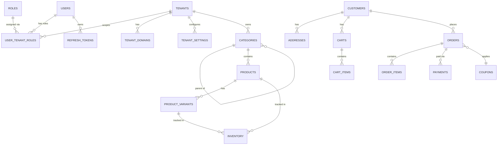

# Database Schema — Marketly Backend Platform

## Design Principles

1. **Tenant isolation via `tenant_id`** — every tenant-owned table carries a `tenant_id UUID NOT NULL`.
2. **Audit columns on every table** — `created_at`, `updated_at`, `created_by`, `updated_by`.
3. **Soft delete** — `deleted_at TIMESTAMPTZ` (NULL = active, non-NULL = deleted). Hard deletes are never performed on business data.
4. **UUIDs as primary keys** — avoids sequential ID enumeration attacks and works across distributed services.
5. **Per-service schema** — each microservice owns its PostgreSQL schema (`identity`, `tenant`, `product`, `customer`, `order`, `notification`, `analytics`). Services never join across schema boundaries; cross-service data is replicated via Kafka or fetched via API.
6. **Flyway migrations** — all DDL lives in `src/main/resources/db/migration/V{n}__{description}.sql` per service.

---

## Audit Base Columns (applied to every table)

```sql
created_at   TIMESTAMPTZ NOT NULL DEFAULT now(),
updated_at   TIMESTAMPTZ NOT NULL DEFAULT now(),
created_by   UUID,          -- user_id who created the row
updated_by   UUID,          -- user_id who last updated
deleted_at   TIMESTAMPTZ    -- NULL = active; soft-delete timestamp when deleted
```

A PostgreSQL trigger automatically sets `updated_at = now()` on every UPDATE.

---

## Schema: `identity`

Owned by: **Identity Service**

### Tables

#### `identity.users`

Stores platform-level user accounts. One user may be linked to multiple tenants with different roles.

```sql
CREATE TABLE identity.users (
    id              UUID PRIMARY KEY DEFAULT gen_random_uuid(),
    email           VARCHAR(320) NOT NULL,
    phone           VARCHAR(20),
    password_hash   VARCHAR(255) NOT NULL,       -- bcrypt hash
    is_verified     BOOLEAN NOT NULL DEFAULT false,
    is_active       BOOLEAN NOT NULL DEFAULT true,
    last_login_at   TIMESTAMPTZ,
    created_at      TIMESTAMPTZ NOT NULL DEFAULT now(),
    updated_at      TIMESTAMPTZ NOT NULL DEFAULT now(),
    created_by      UUID,
    updated_by      UUID,
    deleted_at      TIMESTAMPTZ,
    CONSTRAINT uq_users_email UNIQUE (email)
);

CREATE INDEX idx_users_email       ON identity.users (email) WHERE deleted_at IS NULL;
CREATE INDEX idx_users_phone       ON identity.users (phone) WHERE phone IS NOT NULL AND deleted_at IS NULL;
```

**Why**: Separating user credentials from tenant membership allows a single person (e.g. an owner who also shops) to hold multiple roles across tenants without duplicate accounts.

---

#### `identity.roles`

Lookup table for all system roles.

```sql
CREATE TABLE identity.roles (
    id          UUID PRIMARY KEY DEFAULT gen_random_uuid(),
    name        VARCHAR(50) NOT NULL,   -- SUPER_ADMIN, TENANT_OWNER, STORE_MANAGER, STORE_STAFF, CUSTOMER
    description VARCHAR(255),
    created_at  TIMESTAMPTZ NOT NULL DEFAULT now(),
    updated_at  TIMESTAMPTZ NOT NULL DEFAULT now(),
    CONSTRAINT uq_roles_name UNIQUE (name)
);
```

Seeded at startup:
```
SUPER_ADMIN, TENANT_OWNER, STORE_MANAGER, STORE_STAFF, CUSTOMER
```

---

#### `identity.user_tenant_roles`

Junction table: a user's role within a specific tenant. A user can be `TENANT_OWNER` of tenant A and `CUSTOMER` of tenant B.

```sql
CREATE TABLE identity.user_tenant_roles (
    id          UUID PRIMARY KEY DEFAULT gen_random_uuid(),
    user_id     UUID NOT NULL REFERENCES identity.users(id),
    tenant_id   UUID NOT NULL,                                  -- FK to tenant.tenants (cross-schema reference managed at app level)
    role_id     UUID NOT NULL REFERENCES identity.roles(id),
    assigned_at TIMESTAMPTZ NOT NULL DEFAULT now(),
    assigned_by UUID,
    deleted_at  TIMESTAMPTZ,
    CONSTRAINT uq_user_tenant_role UNIQUE (user_id, tenant_id, role_id)
);

CREATE INDEX idx_utr_user_tenant   ON identity.user_tenant_roles (user_id, tenant_id) WHERE deleted_at IS NULL;
CREATE INDEX idx_utr_tenant        ON identity.user_tenant_roles (tenant_id) WHERE deleted_at IS NULL;
```

**Why**: Role-per-tenant is essential for multi-tenancy. Without this, a staff member at one store would see other stores' data.

---

#### `identity.refresh_tokens`

Stores long-lived refresh tokens. Access tokens are short-lived (15 min) and stateless (JWT).

```sql
CREATE TABLE identity.refresh_tokens (
    id          UUID PRIMARY KEY DEFAULT gen_random_uuid(),
    user_id     UUID NOT NULL REFERENCES identity.users(id),
    tenant_id   UUID,                           -- NULL for super_admin tokens
    token_hash  VARCHAR(255) NOT NULL,          -- SHA-256 of the raw token
    expires_at  TIMESTAMPTZ NOT NULL,
    revoked_at  TIMESTAMPTZ,
    created_at  TIMESTAMPTZ NOT NULL DEFAULT now(),
    user_agent  VARCHAR(512),
    ip_address  INET,
    CONSTRAINT uq_refresh_token_hash UNIQUE (token_hash)
);

CREATE INDEX idx_rt_user_id     ON identity.refresh_tokens (user_id);
CREATE INDEX idx_rt_expires     ON identity.refresh_tokens (expires_at) WHERE revoked_at IS NULL;
```

---

#### `identity.audit_log`

Immutable record of every authentication event. Never updated, never soft-deleted.

```sql
CREATE TABLE identity.audit_log (
    id          UUID PRIMARY KEY DEFAULT gen_random_uuid(),
    user_id     UUID,
    tenant_id   UUID,
    event_type  VARCHAR(80) NOT NULL,   -- LOGIN, LOGOUT, PASSWORD_CHANGE, TOKEN_REVOKED, etc.
    ip_address  INET,
    user_agent  VARCHAR(512),
    metadata    JSONB,
    occurred_at TIMESTAMPTZ NOT NULL DEFAULT now()
);

CREATE INDEX idx_audit_user      ON identity.audit_log (user_id, occurred_at DESC);
CREATE INDEX idx_audit_tenant    ON identity.audit_log (tenant_id, occurred_at DESC);
CREATE INDEX idx_audit_type      ON identity.audit_log (event_type, occurred_at DESC);
```

---

## Schema: `tenant`

Owned by: **Tenant Service**

### Tables

#### `tenant.tenants`

The master record for each store on the platform.

```sql
CREATE TABLE tenant.tenants (
    id                  UUID PRIMARY KEY DEFAULT gen_random_uuid(),
    slug                VARCHAR(100) NOT NULL,          -- URL-safe identifier: "freshmart"
    name                VARCHAR(200) NOT NULL,
    tagline             VARCHAR(500),
    description         TEXT,
    category            VARCHAR(100) NOT NULL,          -- Grocery, Electronics, Pharmacy, etc.
    status              VARCHAR(30) NOT NULL DEFAULT 'PENDING',  -- PENDING, ACTIVE, SUSPENDED, CLOSED
    owner_user_id       UUID NOT NULL,                  -- FK to identity.users
    subscription_plan   VARCHAR(50) NOT NULL DEFAULT 'FREE',     -- FREE, STARTER, GROWTH, ENTERPRISE
    subscription_expires_at TIMESTAMPTZ,
    logo_url            VARCHAR(2048),
    banner_url          VARCHAR(2048),
    accent_color        VARCHAR(30),                    -- Brand color token
    created_at          TIMESTAMPTZ NOT NULL DEFAULT now(),
    updated_at          TIMESTAMPTZ NOT NULL DEFAULT now(),
    created_by          UUID,
    updated_by          UUID,
    deleted_at          TIMESTAMPTZ,
    CONSTRAINT uq_tenants_slug UNIQUE (slug)
);

CREATE INDEX idx_tenants_slug    ON tenant.tenants (slug) WHERE deleted_at IS NULL;
CREATE INDEX idx_tenants_status  ON tenant.tenants (status) WHERE deleted_at IS NULL;
CREATE INDEX idx_tenants_owner   ON tenant.tenants (owner_user_id);
```

**Why**: The `slug` is the primary tenant identifier surfaced in URLs and JWT claims. `category` is free-text to keep the platform generic — no enum constraint, so new store types require no schema change.

---

#### `tenant.tenant_domains`

Maps custom domains (and subdomains) to tenants.

```sql
CREATE TABLE tenant.tenant_domains (
    id          UUID PRIMARY KEY DEFAULT gen_random_uuid(),
    tenant_id   UUID NOT NULL REFERENCES tenant.tenants(id),
    domain      VARCHAR(253) NOT NULL,      -- "freshmart.marketly.com" or "shop.freshmart.in"
    is_primary  BOOLEAN NOT NULL DEFAULT false,
    is_verified BOOLEAN NOT NULL DEFAULT false,
    created_at  TIMESTAMPTZ NOT NULL DEFAULT now(),
    updated_at  TIMESTAMPTZ NOT NULL DEFAULT now(),
    deleted_at  TIMESTAMPTZ,
    CONSTRAINT uq_tenant_domains_domain UNIQUE (domain)
);

CREATE INDEX idx_td_domain      ON tenant.tenant_domains (domain) WHERE deleted_at IS NULL;
CREATE INDEX idx_td_tenant      ON tenant.tenant_domains (tenant_id);
```

---

#### `tenant.tenant_settings`

Flexible key-value configuration per tenant (store hours, delivery radius, payment methods, etc.).

```sql
CREATE TABLE tenant.tenant_settings (
    id          UUID PRIMARY KEY DEFAULT gen_random_uuid(),
    tenant_id   UUID NOT NULL REFERENCES tenant.tenants(id),
    key         VARCHAR(100) NOT NULL,
    value       TEXT NOT NULL,
    value_type  VARCHAR(20) NOT NULL DEFAULT 'STRING',  -- STRING, NUMBER, BOOLEAN, JSON
    created_at  TIMESTAMPTZ NOT NULL DEFAULT now(),
    updated_at  TIMESTAMPTZ NOT NULL DEFAULT now(),
    CONSTRAINT uq_tenant_settings UNIQUE (tenant_id, key)
);

CREATE INDEX idx_ts_tenant_key  ON tenant.tenant_settings (tenant_id, key);
```

**Why**: A settings table avoids schema changes every time a new configuration option is added. The `value_type` column lets the application deserialize correctly.

---

#### `tenant.subscription_plans`

Master list of subscription tiers.

```sql
CREATE TABLE tenant.subscription_plans (
    id                  UUID PRIMARY KEY DEFAULT gen_random_uuid(),
    code                VARCHAR(50) NOT NULL,   -- FREE, STARTER, GROWTH, ENTERPRISE
    name                VARCHAR(100) NOT NULL,
    max_products        INT,                    -- NULL = unlimited
    max_staff_users     INT,
    monthly_price_inr   NUMERIC(10, 2) NOT NULL,
    features            JSONB NOT NULL DEFAULT '[]',
    is_active           BOOLEAN NOT NULL DEFAULT true,
    created_at          TIMESTAMPTZ NOT NULL DEFAULT now(),
    updated_at          TIMESTAMPTZ NOT NULL DEFAULT now(),
    CONSTRAINT uq_plan_code UNIQUE (code)
);
```

---

## Schema: `product`

Owned by: **Product Service**

### Tables

#### `product.categories`

Hierarchical category tree per tenant.

```sql
CREATE TABLE product.categories (
    id          UUID PRIMARY KEY DEFAULT gen_random_uuid(),
    tenant_id   UUID NOT NULL,
    parent_id   UUID REFERENCES product.categories(id),   -- NULL = root category
    name        VARCHAR(200) NOT NULL,
    slug        VARCHAR(200) NOT NULL,
    description TEXT,
    image_url   VARCHAR(2048),
    sort_order  INT NOT NULL DEFAULT 0,
    is_active   BOOLEAN NOT NULL DEFAULT true,
    created_at  TIMESTAMPTZ NOT NULL DEFAULT now(),
    updated_at  TIMESTAMPTZ NOT NULL DEFAULT now(),
    created_by  UUID,
    updated_by  UUID,
    deleted_at  TIMESTAMPTZ,
    CONSTRAINT uq_category_tenant_slug UNIQUE (tenant_id, slug)
);

CREATE INDEX idx_cat_tenant       ON product.categories (tenant_id) WHERE deleted_at IS NULL;
CREATE INDEX idx_cat_parent       ON product.categories (parent_id) WHERE deleted_at IS NULL;
```

**Why**: Self-referential `parent_id` enables an arbitrary-depth category tree (root → sub → sub-sub) without schema changes. `slug` is unique per tenant for clean URLs.

---

#### `product.products`

Core product catalog. One row per product (not per variant).

```sql
CREATE TABLE product.products (
    id              UUID PRIMARY KEY DEFAULT gen_random_uuid(),
    tenant_id       UUID NOT NULL,
    category_id     UUID REFERENCES product.categories(id),
    name            VARCHAR(500) NOT NULL,
    brand           VARCHAR(200),
    description     TEXT,
    sku             VARCHAR(100),                          -- store-defined SKU
    barcode         VARCHAR(100),                         -- EAN/UPC
    unit            VARCHAR(50),                          -- "500g", "1L", "piece"
    price           NUMERIC(12, 2) NOT NULL,
    mrp             NUMERIC(12, 2),                       -- manufacturer suggested price
    cost_price      NUMERIC(12, 2),                       -- for margin calculation
    tax_rate        NUMERIC(5, 2) NOT NULL DEFAULT 0,     -- percentage
    is_active       BOOLEAN NOT NULL DEFAULT true,
    is_featured     BOOLEAN NOT NULL DEFAULT false,
    tags            TEXT[],                               -- ["trending","new","bestseller"]
    attributes      JSONB NOT NULL DEFAULT '{}',          -- flexible: weight, color, size, etc.
    images          JSONB NOT NULL DEFAULT '[]',          -- [{url, alt, sort_order}]
    created_at      TIMESTAMPTZ NOT NULL DEFAULT now(),
    updated_at      TIMESTAMPTZ NOT NULL DEFAULT now(),
    created_by      UUID,
    updated_by      UUID,
    deleted_at      TIMESTAMPTZ,
    CONSTRAINT uq_product_tenant_sku UNIQUE (tenant_id, sku)
);

CREATE INDEX idx_prod_tenant       ON product.products (tenant_id) WHERE deleted_at IS NULL;
CREATE INDEX idx_prod_category     ON product.products (tenant_id, category_id) WHERE deleted_at IS NULL;
CREATE INDEX idx_prod_sku          ON product.products (tenant_id, sku) WHERE sku IS NOT NULL AND deleted_at IS NULL;
CREATE INDEX idx_prod_barcode      ON product.products (tenant_id, barcode) WHERE barcode IS NOT NULL;
CREATE INDEX idx_prod_tags         ON product.products USING gin(tags);
CREATE INDEX idx_prod_attributes   ON product.products USING gin(attributes);
CREATE INDEX idx_prod_name_fts     ON product.products USING gin(to_tsvector('english', name));
```

**Why**: `JSONB` for `attributes` and `images` handles the huge variation across store types (a pharmacy needs batch numbers; a grocery needs nutrition info; electronics need specs). No EAV tables needed.

---

#### `product.product_variants`

Size / color / weight variants of a product.

```sql
CREATE TABLE product.product_variants (
    id              UUID PRIMARY KEY DEFAULT gen_random_uuid(),
    product_id      UUID NOT NULL REFERENCES product.products(id),
    tenant_id       UUID NOT NULL,
    label           VARCHAR(200) NOT NULL,      -- "500ml", "Red / XL"
    sku             VARCHAR(100),
    barcode         VARCHAR(100),
    price_delta     NUMERIC(12, 2) NOT NULL DEFAULT 0,   -- added to parent price
    attributes      JSONB NOT NULL DEFAULT '{}',
    is_active       BOOLEAN NOT NULL DEFAULT true,
    sort_order      INT NOT NULL DEFAULT 0,
    created_at      TIMESTAMPTZ NOT NULL DEFAULT now(),
    updated_at      TIMESTAMPTZ NOT NULL DEFAULT now(),
    deleted_at      TIMESTAMPTZ
);

CREATE INDEX idx_pv_product     ON product.product_variants (product_id) WHERE deleted_at IS NULL;
CREATE INDEX idx_pv_tenant      ON product.product_variants (tenant_id) WHERE deleted_at IS NULL;
```

---

#### `product.inventory`

Stock levels. Separated from products to allow warehouse-level tracking.

```sql
CREATE TABLE product.inventory (
    id                  UUID PRIMARY KEY DEFAULT gen_random_uuid(),
    tenant_id           UUID NOT NULL,
    product_id          UUID NOT NULL REFERENCES product.products(id),
    variant_id          UUID REFERENCES product.product_variants(id),    -- NULL = base product
    warehouse_code      VARCHAR(100) NOT NULL DEFAULT 'DEFAULT',
    quantity_on_hand    INT NOT NULL DEFAULT 0,
    quantity_reserved   INT NOT NULL DEFAULT 0,       -- held by pending orders
    low_stock_threshold INT NOT NULL DEFAULT 5,
    reorder_point       INT NOT NULL DEFAULT 10,
    created_at          TIMESTAMPTZ NOT NULL DEFAULT now(),
    updated_at          TIMESTAMPTZ NOT NULL DEFAULT now(),
    CONSTRAINT uq_inventory UNIQUE (tenant_id, product_id, variant_id, warehouse_code),
    CONSTRAINT chk_qty_non_negative CHECK (quantity_on_hand >= 0)
);

CREATE INDEX idx_inv_tenant_product ON product.inventory (tenant_id, product_id);
CREATE INDEX idx_inv_low_stock      ON product.inventory (tenant_id, quantity_on_hand) WHERE quantity_on_hand <= low_stock_threshold;
```

**Why**: Separating inventory from the product row enables multi-warehouse support and atomic stock adjustments (row-level lock on the inventory row, not the product row).

---

#### `product.inventory_adjustments`

Immutable ledger of every stock change — the source of truth for auditing.

```sql
CREATE TABLE product.inventory_adjustments (
    id              UUID PRIMARY KEY DEFAULT gen_random_uuid(),
    tenant_id       UUID NOT NULL,
    inventory_id    UUID NOT NULL REFERENCES product.inventory(id),
    delta           INT NOT NULL,                   -- positive = add, negative = deduct
    reason          VARCHAR(100) NOT NULL,          -- SALE, RETURN, RESTOCK, DAMAGED, ADJUSTMENT
    reference_id    UUID,                           -- order_id, purchase_order_id, etc.
    reference_type  VARCHAR(50),                    -- ORDER, PURCHASE_ORDER, MANUAL
    note            TEXT,
    performed_by    UUID,
    occurred_at     TIMESTAMPTZ NOT NULL DEFAULT now()
);

CREATE INDEX idx_ia_inventory   ON product.inventory_adjustments (inventory_id, occurred_at DESC);
CREATE INDEX idx_ia_tenant      ON product.inventory_adjustments (tenant_id, occurred_at DESC);
```

---

## Schema: `customer`

Owned by: **Customer Service**

#### `customer.customers`

Customer profiles, scoped to a tenant. A single user_id can be a customer at multiple stores.

```sql
CREATE TABLE customer.customers (
    id              UUID PRIMARY KEY DEFAULT gen_random_uuid(),
    tenant_id       UUID NOT NULL,
    user_id         UUID NOT NULL,                  -- FK to identity.users
    first_name      VARCHAR(100),
    last_name       VARCHAR(100),
    phone           VARCHAR(20),
    date_of_birth   DATE,
    loyalty_points  INT NOT NULL DEFAULT 0,
    tier            VARCHAR(30) NOT NULL DEFAULT 'BRONZE',   -- BRONZE, SILVER, GOLD, PLATINUM
    preferences     JSONB NOT NULL DEFAULT '{}',
    created_at      TIMESTAMPTZ NOT NULL DEFAULT now(),
    updated_at      TIMESTAMPTZ NOT NULL DEFAULT now(),
    created_by      UUID,
    updated_by      UUID,
    deleted_at      TIMESTAMPTZ,
    CONSTRAINT uq_customer_tenant_user UNIQUE (tenant_id, user_id)
);

CREATE INDEX idx_cust_tenant    ON customer.customers (tenant_id) WHERE deleted_at IS NULL;
CREATE INDEX idx_cust_user      ON customer.customers (user_id);
```

---

#### `customer.addresses`

Saved addresses for a customer.

```sql
CREATE TABLE customer.addresses (
    id          UUID PRIMARY KEY DEFAULT gen_random_uuid(),
    tenant_id   UUID NOT NULL,
    customer_id UUID NOT NULL REFERENCES customer.customers(id),
    label       VARCHAR(50),            -- "Home", "Office"
    line1       VARCHAR(300) NOT NULL,
    line2       VARCHAR(300),
    city        VARCHAR(100) NOT NULL,
    state       VARCHAR(100),
    pincode     VARCHAR(20) NOT NULL,
    country     VARCHAR(100) NOT NULL DEFAULT 'IN',
    latitude    NUMERIC(9, 6),
    longitude   NUMERIC(9, 6),
    is_default  BOOLEAN NOT NULL DEFAULT false,
    created_at  TIMESTAMPTZ NOT NULL DEFAULT now(),
    updated_at  TIMESTAMPTZ NOT NULL DEFAULT now(),
    deleted_at  TIMESTAMPTZ
);

CREATE INDEX idx_addr_customer  ON customer.addresses (customer_id) WHERE deleted_at IS NULL;
```

---

## Schema: `order`

Owned by: **Order Service**

#### `order.carts`

Persistent server-side cart (also cached in Redis).

```sql
CREATE TABLE order.carts (
    id              UUID PRIMARY KEY DEFAULT gen_random_uuid(),
    tenant_id       UUID NOT NULL,
    customer_id     UUID,                           -- NULL = guest cart
    session_id      VARCHAR(255),                   -- for guest carts
    coupon_code     VARCHAR(50),
    status          VARCHAR(20) NOT NULL DEFAULT 'ACTIVE',   -- ACTIVE, CONVERTED, ABANDONED
    expires_at      TIMESTAMPTZ,
    created_at      TIMESTAMPTZ NOT NULL DEFAULT now(),
    updated_at      TIMESTAMPTZ NOT NULL DEFAULT now()
);

CREATE INDEX idx_cart_customer  ON order.carts (tenant_id, customer_id) WHERE status = 'ACTIVE';
CREATE INDEX idx_cart_session   ON order.carts (session_id) WHERE session_id IS NOT NULL;
```

---

#### `order.cart_items`

Line items in a cart.

```sql
CREATE TABLE order.cart_items (
    id          UUID PRIMARY KEY DEFAULT gen_random_uuid(),
    cart_id     UUID NOT NULL REFERENCES order.carts(id),
    tenant_id   UUID NOT NULL,
    product_id  UUID NOT NULL,                      -- cross-schema, no FK
    variant_id  UUID,
    product_name VARCHAR(500) NOT NULL,             -- snapshot at time of add
    unit_price  NUMERIC(12, 2) NOT NULL,            -- snapshot
    quantity    INT NOT NULL DEFAULT 1,
    created_at  TIMESTAMPTZ NOT NULL DEFAULT now(),
    updated_at  TIMESTAMPTZ NOT NULL DEFAULT now(),
    CONSTRAINT uq_cart_item UNIQUE (cart_id, product_id, variant_id),
    CONSTRAINT chk_cart_qty CHECK (quantity > 0)
);

CREATE INDEX idx_ci_cart        ON order.cart_items (cart_id);
```

**Why**: Price and name are snapshotted at add-to-cart time. If a store owner changes a price mid-session, the cart reflects the price the customer saw — preventing silent surprises at checkout.

---

#### `order.orders`

The order header record.

```sql
CREATE TABLE order.orders (
    id                  UUID PRIMARY KEY DEFAULT gen_random_uuid(),
    tenant_id           UUID NOT NULL,
    customer_id         UUID NOT NULL,
    order_number        VARCHAR(30) NOT NULL,        -- human-readable: TEN-20260616-0001
    status              VARCHAR(30) NOT NULL DEFAULT 'PLACED',
    -- PLACED → CONFIRMED → PACKING → OUT_FOR_DELIVERY → DELIVERED | CANCELLED | RETURNED
    subtotal            NUMERIC(12, 2) NOT NULL,
    discount_amount     NUMERIC(12, 2) NOT NULL DEFAULT 0,
    delivery_charge     NUMERIC(12, 2) NOT NULL DEFAULT 0,
    tax_amount          NUMERIC(12, 2) NOT NULL DEFAULT 0,
    total_amount        NUMERIC(12, 2) NOT NULL,
    coupon_code         VARCHAR(50),
    delivery_slot       VARCHAR(100),
    delivery_address_id UUID,                        -- cross-schema reference
    delivery_address    JSONB NOT NULL,              -- snapshot of address at order time
    payment_method      VARCHAR(30) NOT NULL,        -- COD, UPI, CARD, WALLET
    notes               TEXT,
    placed_at           TIMESTAMPTZ NOT NULL DEFAULT now(),
    confirmed_at        TIMESTAMPTZ,
    delivered_at        TIMESTAMPTZ,
    cancelled_at        TIMESTAMPTZ,
    created_at          TIMESTAMPTZ NOT NULL DEFAULT now(),
    updated_at          TIMESTAMPTZ NOT NULL DEFAULT now(),
    created_by          UUID,
    CONSTRAINT uq_order_number UNIQUE (tenant_id, order_number)
);

CREATE INDEX idx_ord_tenant_status  ON order.orders (tenant_id, status) WHERE cancelled_at IS NULL;
CREATE INDEX idx_ord_customer       ON order.orders (customer_id, placed_at DESC);
CREATE INDEX idx_ord_placed_at      ON order.orders (tenant_id, placed_at DESC);
CREATE INDEX idx_ord_number         ON order.orders (tenant_id, order_number);
```

---

#### `order.order_items`

Line items in an order — fully snapshotted.

```sql
CREATE TABLE order.order_items (
    id              UUID PRIMARY KEY DEFAULT gen_random_uuid(),
    order_id        UUID NOT NULL REFERENCES order.orders(id),
    tenant_id       UUID NOT NULL,
    product_id      UUID NOT NULL,
    variant_id      UUID,
    product_name    VARCHAR(500) NOT NULL,
    variant_label   VARCHAR(200),
    sku             VARCHAR(100),
    unit_price      NUMERIC(12, 2) NOT NULL,
    quantity        INT NOT NULL,
    line_total      NUMERIC(12, 2) NOT NULL,
    image_url       VARCHAR(2048),
    created_at      TIMESTAMPTZ NOT NULL DEFAULT now()
);

CREATE INDEX idx_oi_order       ON order.order_items (order_id);
CREATE INDEX idx_oi_product     ON order.order_items (product_id);
```

---

#### `order.payments`

Payment attempt records for an order.

```sql
CREATE TABLE order.payments (
    id                  UUID PRIMARY KEY DEFAULT gen_random_uuid(),
    order_id            UUID NOT NULL REFERENCES order.orders(id),
    tenant_id           UUID NOT NULL,
    amount              NUMERIC(12, 2) NOT NULL,
    currency            CHAR(3) NOT NULL DEFAULT 'INR',
    method              VARCHAR(30) NOT NULL,        -- UPI, CARD, COD, WALLET
    gateway             VARCHAR(50),                 -- RAZORPAY, STRIPE, COD
    gateway_payment_id  VARCHAR(255),
    gateway_order_id    VARCHAR(255),
    status              VARCHAR(30) NOT NULL DEFAULT 'PENDING',
    -- PENDING → PROCESSING → COMPLETED | FAILED | REFUNDED
    paid_at             TIMESTAMPTZ,
    refunded_at         TIMESTAMPTZ,
    refund_amount       NUMERIC(12, 2),
    metadata            JSONB,
    created_at          TIMESTAMPTZ NOT NULL DEFAULT now(),
    updated_at          TIMESTAMPTZ NOT NULL DEFAULT now()
);

CREATE INDEX idx_pay_order      ON order.payments (order_id);
CREATE INDEX idx_pay_gateway    ON order.payments (gateway_payment_id) WHERE gateway_payment_id IS NOT NULL;
```

---

#### `order.coupons`

Coupon definitions per tenant.

```sql
CREATE TABLE order.coupons (
    id              UUID PRIMARY KEY DEFAULT gen_random_uuid(),
    tenant_id       UUID NOT NULL,
    code            VARCHAR(50) NOT NULL,
    description     VARCHAR(500),
    type            VARCHAR(20) NOT NULL,    -- PERCENT, FLAT, FREE_DELIVERY
    value           NUMERIC(10, 2) NOT NULL, -- percent or flat INR amount
    min_order_value NUMERIC(12, 2),
    max_discount    NUMERIC(12, 2),
    usage_limit     INT,                     -- total uses allowed; NULL = unlimited
    used_count      INT NOT NULL DEFAULT 0,
    per_user_limit  INT NOT NULL DEFAULT 1,
    valid_from      TIMESTAMPTZ NOT NULL,
    valid_until     TIMESTAMPTZ,
    is_active       BOOLEAN NOT NULL DEFAULT true,
    customer_ids    UUID[],                  -- NULL = all customers; otherwise restricted list
    created_at      TIMESTAMPTZ NOT NULL DEFAULT now(),
    updated_at      TIMESTAMPTZ NOT NULL DEFAULT now(),
    created_by      UUID,
    deleted_at      TIMESTAMPTZ,
    CONSTRAINT uq_coupon_tenant_code UNIQUE (tenant_id, code)
);

CREATE INDEX idx_coupon_tenant  ON order.coupons (tenant_id, code) WHERE deleted_at IS NULL AND is_active = true;
```

---

## Schema: `notification`

Owned by: **Notification Service**

#### `notification.notifications`

```sql
CREATE TABLE notification.notifications (
    id              UUID PRIMARY KEY DEFAULT gen_random_uuid(),
    tenant_id       UUID,                           -- NULL = platform-wide
    recipient_id    UUID NOT NULL,                  -- user_id
    type            VARCHAR(30) NOT NULL,           -- EMAIL, SMS, PUSH, IN_APP
    channel         VARCHAR(30) NOT NULL,           -- ORDER_UPDATE, LOW_STOCK, PROMOTION, etc.
    title           VARCHAR(255) NOT NULL,
    body            TEXT NOT NULL,
    data            JSONB,
    status          VARCHAR(20) NOT NULL DEFAULT 'PENDING',  -- PENDING, SENT, FAILED, READ
    sent_at         TIMESTAMPTZ,
    read_at         TIMESTAMPTZ,
    reference_id    UUID,                           -- order_id, product_id, etc.
    reference_type  VARCHAR(50),
    created_at      TIMESTAMPTZ NOT NULL DEFAULT now()
);

CREATE INDEX idx_notif_recipient    ON notification.notifications (recipient_id, created_at DESC);
CREATE INDEX idx_notif_tenant       ON notification.notifications (tenant_id, created_at DESC) WHERE tenant_id IS NOT NULL;
CREATE INDEX idx_notif_status       ON notification.notifications (status) WHERE status = 'PENDING';
```

---

## ER Diagram (Mermaid)



---

## Index Strategy Summary

| Table | Index Type | Columns | Reason |
|---|---|---|---|
| `users` | B-tree | `email` | Login lookup |
| `products` | GIN | `tags`, `attributes` | Array/JSONB containment queries |
| `products` | GIN FTS | `to_tsvector(name)` | Full-text product search |
| `inventory` | B-tree partial | `tenant_id, qty` where `qty <= threshold` | Low-stock alerts scan |
| `orders` | B-tree | `tenant_id, status` | Admin order list by status |
| `orders` | B-tree | `customer_id, placed_at DESC` | Customer order history |
| `audit_log` | B-tree | `user_id, occurred_at DESC` | Per-user audit trail |
| All tenant tables | B-tree | `tenant_id` | Baseline multi-tenant filter |

---

## Flyway Migration Convention

```
src/main/resources/db/migration/
  V1__create_schema.sql
  V2__create_users.sql
  V3__create_roles.sql
  V4__seed_roles.sql
  V5__create_refresh_tokens.sql
  V6__create_audit_log.sql
  V7__create_indexes.sql
```

Migration files are **never modified after merge** to main. Corrections use new migration files (V8, V9...).
